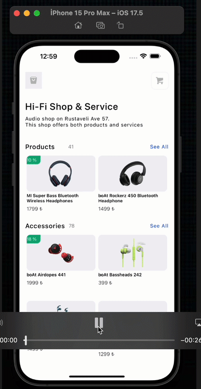

<h1>E-Commerce App</h1>

A React Native project built with React Native CLI, designed to provide users with a seamless online shopping experience. The app features intuitive navigation, a responsive UI, and persistent data storage using Async Storage to enhance user engagement.

<h2>Features</h2>

<ul>
  <li>Async Storage: Utilizing <code>@react-native-async-storage/async-storage</code>, the app ensures user data and cart items are saved and retrieved even after the app is closed.</li>
  
  <li>Lottie Animations: The app incorporates <code>lottie-react-native</code> to add engaging animations, enhancing visual appeal and user interaction.</li>
  
  <li>Product Listing: Users can browse a wide variety of products with detailed descriptions and images.</li>
  
  <li>Shopping Cart: The app allows users to add items to their cart and manage their purchases seamlessly.</li>

</ul>

<h2>Preview:</h2>

